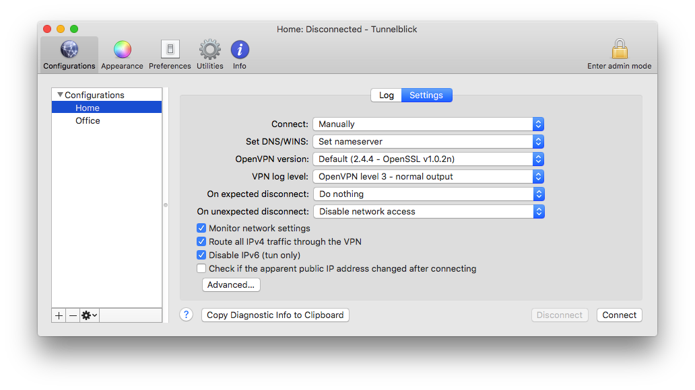

# VPN Kill Switch for Linux, Windows and MacOS

Running a VPN without a Kill switch is not recommended. 
While most VPN providers out there implement their own Kill switch services - we, the minimalists, the ones who like to [create custom VPN servers](https://nologs-vpn.com), are often left to wonder for solutions as many of the official packages do not implement such a thing.

VPN connections drop at any time and sometimes drop quite often, a time when your real ip address, dns and other sensitive data is free to leak outside of the tunnel. 
By using a VPN Kill Switch you basically kill any other traffic outside of the tunnel. We have a more extensive article on this subject if you want to find more about [how a Kill Switch works](http://localhost:8000/vpn-killswitch-what-is-do-you-need). 

This repo is still a work in progress and I welcome everyone to participate with ideas, feedback or code.

Shameless plug

## Build your own no logs secure VPN
This project is part of the [nologs-vpn](https://nologs-vpn.com) project. nologs-vpn allows you to create VPN servers hosted on your own VM server. For a small fee our service creates the server, installs the desired VPN service and generates client config so you can connect. In just 5 minutes you can have your own, private and secure, VPN server that has no logs, no backdoors and is powered by tested, open-source software.

## (Linux) How to use the script
The Linux Kill Switch tries to guess as many info as possible while allowing you to overwrite these params.

1. After downloading the script you need to make it executable: `chmod +x /full/path/to/linux-killswitch.sh`
2. The script is ready to run without any params only if you're running an OpenVPN instance which creates a `tun0` interface or you're running a WireGuard instance which creates a `wg0` interface
3. If the above is not the case you can use the param `-i` and specify the VPN interface
4. The script also tries to guess the default public interface. If it fails to detect it you can use the param `-d` to overwrite it
5. The script uses a remote service to detect your IP address (evidently: this script should be executed after connecting to VPN) and save it as the remote in order to whitelist the communication with the VPN server when applying the Kill Switch. If you need to overwrite it use the `-r` parameter.
6. The script blocks waiting for your exit signal (CTRL+C) which may be undesirable in `up`/`down` (OpenVPN) or `PostUp`/`PostDown` (WireGuard) so I added another flag `-b false` which prevents the script from waiting for an exit signal. When using this flag the script will create the firewall lock and exit so you are responsible for unlocking by calling `sudo /full/path/to/linux-killswitch.sh unlock` (using the `PostUp`/`PostDown` and `up`/`down` directives is NOT recommended - read further down)

Full example (with all params) of running this kill switch:
    `sudo /full/path/to/linux-killswitch.sh -i tun0 -r 123.213.132.231 -d eth0`

Keep in mind that __iptables is used__ to setup the firewall. Before setting up the switch we backup your existing iptables rules to a local file, next to this script. If you're adding new rules to iptables while this script is running, they will be lost once the script exits since it performs a full restore from backup.

## (Linux) How to delete the rules

In case something unexpected takes place and you're stuck with a non-working internet due to iptables rules that failed to be removed you can use the `sudo /full/path/to/linux-killswitch.sh unlock` command and attempt to delete them again.

## (MacOS) usage tutorial

MacOS usage is exactly as Linux so refer to that for the available commands and flags.

### Using Tunnelblick? It already has a KillSwitch

If you're using Tunnelblick to connect to a VPN keep in mind that it has a good Kill Switch included and I suggest you [give it a try](https://tunnelblick.net/cKillSwitch.html).

## Openvpn `up`/`down` kill switch

Embedding the Kill Switch as part of the `up`/`down` directives in OpenVPN is tempting but not recommended. It works but the `down` script might get triggered when the VPN disconnects and that defeats the purpose of a Kill Switch. Doing it this way you leave OpenVPN as the sole guvernor of this process and that's exactly what we're trying to avoid.

One way of doing it would be to just specify an `up` directive and bring it down yourself manually once you decide to disconnect by executing: `sudo /full/path/to/linux-killswitch.sh unlock`

## WireGuard `PostUp`/`PostDown`

Same goes for WireGuard as with OpenVPN in regards to the `PostUp`/`PostDown` directives.